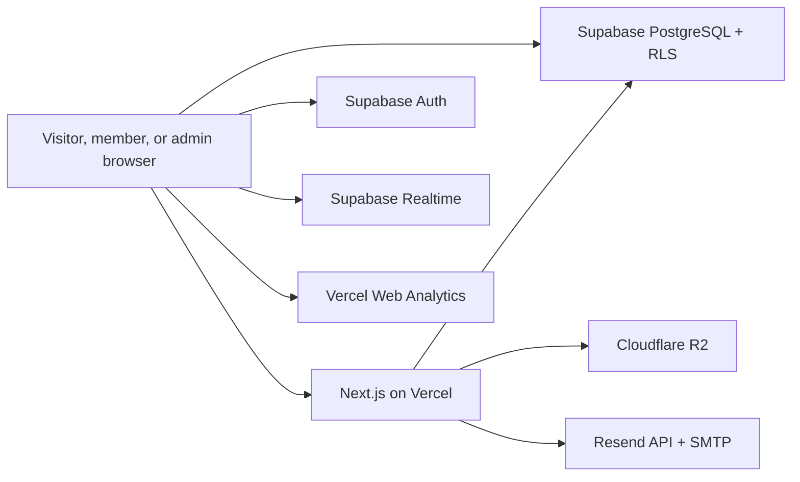

# ARCHITECTURE — Nasora

## Architecture goals

- Fit the initial workload within free tiers without depending on non-commercial hosting terms
- Keep public pages fast despite high-quality artwork and ambient motion
- Protect customer files, slips, messages, quotes, and payment history
- Let the service catalog, forms, pricing guidance, documents, and status workflows evolve without code changes
- Isolate Home, Portfolio, and Commission layouts so changes do not leak across pages
- Keep the runtime deployable through Vercel's Git integration

## Selected stack

| Layer           | Choice                              | Responsibility                                                               |
| --------------- | ----------------------------------- | ---------------------------------------------------------------------------- |
| Web application | Next.js with TypeScript             | Public UI, member UI, admin UI, route handlers, static and dynamic rendering |
| Hosting         | Vercel                             | Application runtime, static assets, functions, and scheduled cleanup          |
| Database        | Supabase PostgreSQL                 | Product data, requests, quotes, jobs, payments, content, audit history       |
| Authentication  | Supabase Auth                       | Email/password, Google OAuth, sessions, password reset                       |
| Realtime        | Supabase Realtime                   | Member messages, notifications, and status refresh                           |
| Object storage  | Cloudflare R2                       | Public derivatives, private originals, private customer assets               |
| Email           | Resend API and SMTP                 | Administrator notifications and Supabase Auth mail                           |
| Analytics       | Vercel Web Analytics                | Traffic and Core Web Vitals monitoring                                       |

Resend's API handles the administrator outbox with an idempotency key per event. Supabase Auth uses Resend SMTP after a dedicated sending domain is verified. The test sender is limited to the Resend account owner's address and is suitable only for development checks.

## System context



## Rendering and CPU strategy

### Public routes

- Home, Portfolio, Commission, Queue, Document Center, document URLs, and About use static generation or ISR
- Public data is cacheable and invalidated after an administrator publishes relevant changes
- Media is served from pre-generated derivatives; the Worker does not resize or transcode images at request time
- Contextual search operates on page-scoped indexed data and does not render a global search backend

### Authenticated routes

- Member and admin routes are dynamic and must never be cached publicly
- Supabase SSR sessions use secure cookies and PKCE
- Responses that refresh a session explicitly remain private and `no-store`
- Browser may access authorized rows through the Supabase publishable key only when RLS enforces ownership

### Worker responsibilities

- Render or serve cached Next.js routes
- Generate or authorize short-lived R2 operations
- Perform privileged mutations that require server secrets
- Receive scheduled cleanup invocations
- Never perform image conversion, video transcoding, large PDF generation, or other CPU-heavy work in Phase 1

## Application modules

```text
src/
  app/
    (public)/
    (member)/
    (admin)/
  features/
    auth/
    home/
    portfolio/
    commission-catalog/
    commission-requests/
    quotes/
    jobs/
    payments/
    queue/
    messaging/
    notifications/
    documents/
    media/
    settings/
  layouts/
    public-shell/
    home-featured/
    portfolio-gallery/
    commission-album/
    member-shell/
    admin-shell/
  ui/
    primitives/
  lib/
    supabase/
    r2/
    email/
    i18n/
    security/
```

Feature modules own their data adapters, validation, business rules, and composite UI. The shared `ui/primitives` layer may contain stable low-level controls such as Button, Input, Dialog, Badge, and Table. It must not contain a shared gallery or page layout used by Home, Portfolio, and Commission.

Component placement follows ownership rather than Atomic Design folder names. Core code in `src/shared` cannot import a product feature; `src/app` is the composition layer; and generic infrastructure used by multiple domains belongs to Core. The complete ownership matrix, promotion rule, and review checklist live in [`docs/architecture/component-ownership.md`](docs/architecture/component-ownership.md).

## Page layout isolation

- `HomeFeaturedLayout` owns Home-only featured composition and responsive behavior
- `HeroMedia` reads only enabled Hero placements, chooses one item per Home visit, and keeps the choice stable without timed rotation
- `FeaturedWorkCarousel` owns autoplay, manual navigation, pause behavior, visibility handling, and reduced-motion behavior without being reused by Portfolio
- `PortfolioGalleryLayout` owns the Portfolio grid and filters
- `CommissionAlbumLayout` owns category, subtype, detail, price, and request presentation
- CSS modules or feature-scoped styles prevent selectors from leaking across layouts
- Shared media primitives receive explicit size and aspect-ratio contracts rather than controlling parent layout
- Visual regression tests cover each page independently

## Data access boundaries

### Public

Anonymous users may read only published services, public pricing guidance, public media derivatives, published documents, visible contact channels, site settings intended for public display, and public queue projections.

### Member

Authenticated members may read and mutate only their profile and permitted rows linked to their `auth.uid()`. They cannot select another `user_id`, elevate roles, verify payments, edit quote totals, or move job statuses.

The request form resolves identity before rendering its contact section. Authenticated sessions receive a Member module populated from the member profile and saved contact methods. Anonymous sessions receive Guest fields. The selected or overridden contact value is copied into a private request snapshot so later Profile edits do not rewrite existing requests.

### Administrator

Administrator authorization is derived from server-managed `app_metadata`, never user-editable profile metadata. Sensitive writes use server-side validation even when an RLS policy also permits the admin.

### Guest

Guest request creation uses an anonymous server endpoint that stores the supplied contact details. Guest rows have no authenticated owner and are never exposed through a private guest API. Public queue reads use a safe projection containing only display name, status, type, deadline, and order.

## Media architecture

### Buckets

1. `nasora-public-media`
   - WebP thumbnails, card images, detail images, poster images, and public MP4 files
   - Served through an application media route or production custom domain when available
2. `nasora-original-media`
   - Original administrator-uploaded PNG/JPG assets
   - Private, admin-only access
3. `nasora-customer-files`
   - Request references, message images, payment slips, and delivery files
   - Private and accessed through short-lived authorization

### Upload pipeline

1. Admin selects an image
2. Browser validates file type and size
3. Browser generates thumbnail, card, and detail WebP variants
4. Server creates restricted upload authorizations
5. Browser uploads original and derivatives directly to R2
6. Database transaction records all object keys, sizes, hashes, variants, and placements
7. A placement is attached independently to Home, Portfolio, or Commission

Member uploads follow the same authorization approach but do not create public derivatives unless a small private preview is necessary.

### Deletion safety

- Removing a placement never deletes the underlying media asset
- Deleting a media asset shows every active placement and requires confirmation
- Customer asset expiry is based on job completion plus 30 days
- Payment slips are excluded from automatic deletion

## Quote and price model

- Catalog pricing is reference content only
- A request never calculates its own final price
- Administrator creates a manual quote and itemized amounts after reviewing the request
- Quote stores its own amounts, deposit rate, revision allowance, timeframe, expiry, and Terms version
- Later catalog changes do not mutate existing quotes
- Accepted job totals may be adjusted for customer-requested scope changes; every adjustment is itemized and audited

## Payment model

- Payment states: pending slip, under review, verified, rejected, refunded, and void
- Deposit must be verified before partial payment becomes available
- Every partial payment is a separate ledger entry and slip review
- Outstanding balance is derived from current job charge items minus verified payments plus/minus refunds and adjustments
- Financial totals use integer satang values; display formatting converts to THB
- USD is never stored as a payable amount; it is calculated for display from the configured reference rate

## Realtime and notifications

- Supabase Realtime subscribes only to rows the signed-in member may access
- Messages and notification events are persisted before being broadcast
- If Realtime disconnects, the UI fetches missed records using the last seen timestamp
- Unread counts are computed from persisted read markers
- Phase 1 customer notifications remain inside the website
- Administrator receives email for new requests, messages, slips, expiry reminders, and scheduled job failures

## Scheduled jobs

A daily idempotent cleanup job processes small batches:

1. Mark expired delivery links unavailable
2. Delete expired R2 delivery and reference/message assets
3. Create Google Drive deletion reminders
4. Close quotes whose expiry has elapsed
5. Retry failed administrator emails within a bounded policy
6. Write success or failure to the audit log

The job uses cursors and bounded batches so one invocation cannot grow without limit.

## Security controls

- RLS enabled on every exposed table
- Ownership predicates accompany `TO authenticated`; role membership alone is insufficient
- Update policies include both `USING` and `WITH CHECK`
- No `service_role` or R2 secret is exposed to the browser
- Public rich text is sanitized before rendering
- File keys are generated server-side and never accept path traversal
- Upload authorization restricts object key, content type, and expiry
- Rate and abuse protection is deferred from the product UI but server validation and platform-level limits remain mandatory
- Audit entries are append-only to normal application roles
- Privacy Policy discloses data, retention, processors, and account-deletion contact flow

## Performance budgets

- LCP ≤ 2.5 seconds at the 75th percentile
- INP ≤ 200 milliseconds at the 75th percentile
- CLS ≤ 0.1 at the 75th percentile
- No unoptimized PNG/JPG is delivered in public card or gallery grids
- Noncritical images and video do not load before entering the viewport
- Particle canvas pauses when the page is hidden
- Mobile uses a reduced particle count and no pointer physics
- Route JavaScript is split by feature; admin code is not included in public route bundles

## Observability

- Vercel Web Analytics for page and Core Web Vitals data
- Vercel logs for function errors and scheduled invocations
- Supabase Auth, database, and Realtime logs for backend issues
- Application audit log for business actions
- Admin dashboard warning when cleanup or email delivery fails

## Runtime operations

Review Vercel function errors, cron executions, and Core Web Vitals after each production release. Keep Supabase and R2 endpoints independent of the deployment lifecycle so application releases remain reversible.

### Email

Resend's test sender may be used for administrator-only development checks. Before customer-facing email is enabled, authenticate a dedicated sending subdomain with SPF and DKIM, add DMARC, and configure the verified sender in both the application and Supabase Auth.

### Supabase inactivity and backup

Free-tier pause behavior and lack of downloadable managed backups require a scheduled logical database export before production data becomes material. The migration plan defines the backup and restore drill.
