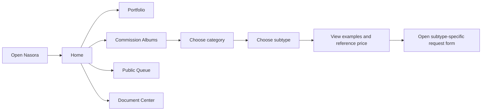
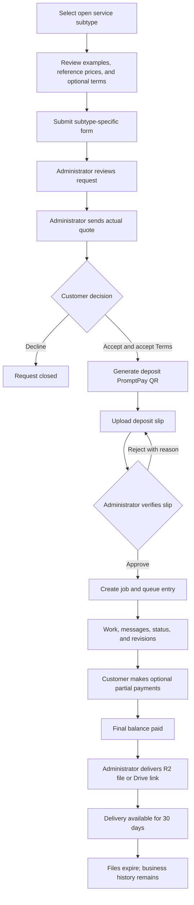
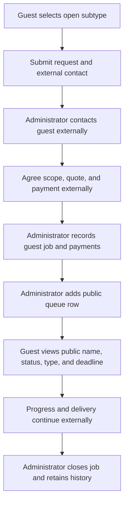

# USER FLOW — Nasora

## Public discovery flow

The visitor may use the Home Quick Info Panel to inspect About, Queue, Terms, and Contact without leaving Home. Contextual search is scoped to the current page.

On each Home open or refresh, the application selects one enabled Hero image from the administrator-managed pool. That image remains stable for the visit. The separate featured-work carousel advances automatically, exposes manual controls, and pauses for interaction, hidden tabs, or reduced-motion preference.

## Floating Button flow

### Signed out

1. Visitor activates the bottom-right Floating Button
2. Authentication panel opens
3. Visitor selects email/password login, registration, or Google login
4. Successful login changes the same button to the member state

### Signed in

1. Member sees avatar and unread count
2. Activating the button opens notifications and member shortcuts
3. Member navigates to My Requests, Messages, Profile, or Logout
4. Administrator also sees a Dashboard shortcut

## Registered commission flow

### Request submission

- Service category and subtype are filled from the originating page
- Closed subtype cannot open or submit the form
- Authenticated member sees a Member module populated with profile nickname and saved contact channels
- Member selects a saved contact channel and may override it only for the current request
- Signed-out visitor sees required Guest name and external-contact fields instead
- Customer supplies budget, creative details, reference images, and subtype-specific answers
- Submitted form is not edited by the customer afterward

### Quote decision

- Catalog prices help the customer decide whether to request a quote
- Administrator evaluates complexity and manually creates the actual quote
- Quote is itemized and includes the deposit rate, revision allowance, timeframe, expiry, and Terms version
- Quote is valid for 3–7 days unless administrator closes it earlier
- Acceptance stores the exact Terms version and timestamp

### Deposit and queue

- Default deposit is 50% but the quote may override it
- QR encodes the exact amount due
- Customer uploads a slip
- Rejected slip returns to the customer with a reason
- Approved deposit assigns the public queue order using verification time
- Administrator may override the queue order and must leave an audit reason

### Progress and revisions

- Member receives in-site notifications from the Floating Button
- Member and administrator exchange text and images
- Member submits a revision request
- Revision count increases only when administrator accepts the request
- Default free allowance is 4
- Excess revision or added scope creates an itemized adjustment and updates the outstanding balance
- Administrator controls service-specific job statuses

### Partial and final payment

- Partial payment is unavailable until deposit is approved
- Customer chooses an amount between the configurable minimum and outstanding balance
- If outstanding balance is below the minimum, only full remaining balance is accepted
- Each payment produces its own QR, slip, verification record, and ledger entry
- Delivery normally remains locked until outstanding balance equals zero

### Delivery

- Delivery is either an R2 file or a Google Drive URL
- Customer sees delivery date and expiry date
- R2 access is signed and temporary
- At 30 days, R2 files are deleted; Drive links are hidden and an admin cleanup email is sent
- Job remains in permanent history after assets expire

## Guest commission flow

Guest limitations:

- No private tracking page
- No website messages
- No online quote acceptance
- No customer-side slip upload
- No access to payment, revision, or delivery details
- Public queue visibility is identical to any other public visitor

## Administrator flow

1. Receive email and dashboard notification for a new request
2. Review answers and references
3. Create an itemized actual quote independent of catalog guidance
4. Send quote to a registered member or record external guest agreement
5. Review deposit slip and approve or reject it
6. Confirm queue entry and deadline
7. Move job through the service-specific status workflow
8. Respond to messages and accept revision requests
9. Record scope additions, partial payments, refunds, and balance changes
10. Deliver the file or Drive link
11. Monitor 30-day expiry and cleanup results
12. Keep permanent business history and audit trail

## Cancellation and refund flow

### Before deposit

- Registered customer may cancel the pending request or quote
- Administrator may close an expired or inactive quote

### After deposit but before work-start status

- Customer contacts administrator
- Administrator decides full, partial, or no refund case by case
- Refund amount, method, reason, and date are recorded

### At or after work-start status

- The initial work-start status is `กำลังร่าง`
- Deposit is non-refundable
- Administrator records cancellation status and reason

## Failure and recovery flows

- Failed upload: preserve form inputs and allow retry
- Expired upload URL: request a new signed URL without losing the selected record
- Rejected slip: show reason and issue a new upload action
- Expired quote: prevent acceptance and direct customer to request a new quote
- Closed service during an open form: validate again on submission and explain that the service has closed
- Deleted or expired delivery asset: show expiry information rather than a broken link
- Email failure: retain an admin alert in the dashboard and retry through the scheduled job
- Realtime disconnection: fall back to refresh/polling without losing messages
